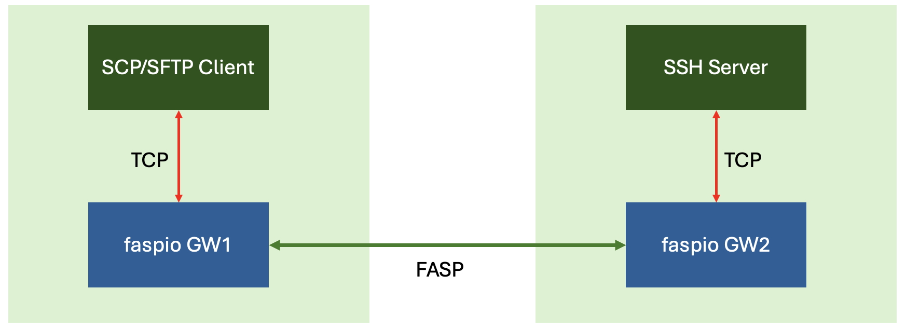
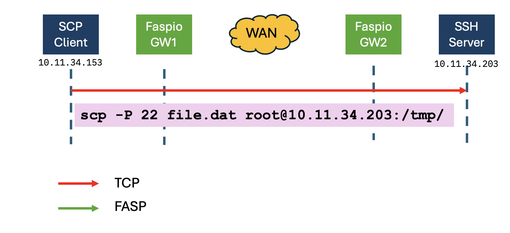
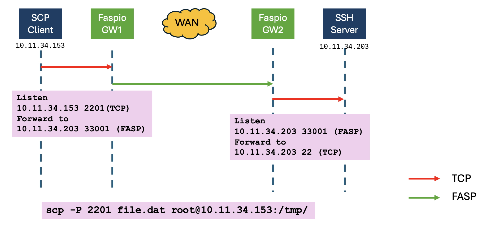

# explore-faspio
Explore faspio acceleration for SCP.   
To see good acceleration results, the 2 machines should be located across a WAN. Otherwise, you can still see functionalities but not performance.    

This is a test setup. SCP Application and faspio will be located in the same machines.    

Reference: [https://www.ibm.com/docs/en/faspio-gateway/1.3.0](https://www.ibm.com/docs/en/faspio-gateway/1.3.0)   

## Pre-Requisites
1. 2 servers with at least 2 cores, 8GB RAM and 20GB storage. RHEL 8.x Operating System.   

## Test Transfer without faspio

    From GW1 machine:
    scp -P <SSH-PORT> file.dat root@<GW2-IP>>:/tmp/
    E.g.
    scp -P 22 file.dat root@10.11.34.203:/tmp/
    

## Deployment and Setup

1. Download faspio from the Download site. Link to download: 
[https://www.ibm.com/products/aspera/downloads](https://www.ibm.com/products/aspera/downloads)  

2. Install faspio on both machines.  

        rpm -Uvh ibm-aspera-faspio-gateway-*.rpm   

3. Install license in the server machine only (GW2 ONLY)   
Edit the file /etc/faspio-gateway/aspera-license and past the license data.    
GW1 machine will act as a client. So does not require license. 

4. This is what we will configure faspio to do.  

5. Configure faspio in GW1.   
Edit /etc/faspio-gateway/gateway.toml. Configure as below. [Use defaults for general and admin sections]

        #######################
        ## GATEWAY SETTINGS
        #######################
        [general]
            fips_enabled = true

        [admin]
        prometheus_enabled = false
        rest_api_enabled = false
            bind_address = "127.0.0.1"
                    port = 8080
            tls_enabled = false  # Set this to true to enable TLS on the admin services

        [[bridge]]
            ### Where and how to accept connections locally
            [bridge.local]
                protocol = "tcp"
            bind_address = "10.11.34.153"
                    port = 2201
            tls_enabled = false   # Set this to true to enable TLS on the local abutment

            ### Where and how to forward connections
            [bridge.forward]
                protocol = "fasp"
                    host = "10.11.34.203"
                    port = 33001
            tls_enabled = false   # Set this to true to enable TLS on the forward abutment

6. Configure faspio in GW2.
Edit /etc/faspio-gateway/gateway.toml. Configure as below. [Use defaults for general and admin sections]

        #######################
        ## GATEWAY SETTINGS
        #######################
        [general]
            fips_enabled = true

        [admin]
        prometheus_enabled = false
        rest_api_enabled = false
            bind_address = "127.0.0.1"
                    port = 8080
            tls_enabled = false  # Set this to true to enable TLS on the admin services

        [[bridge]]
            ### Where and how to accept connections locally
            [bridge.local]
                protocol = "fasp"
            bind_address = "10.11.34.203"
                    port = 33001
            tls_enabled = false   # Set this to true to enable TLS on the local abutment

            ### Where and how to forward connections
            [bridge.forward]
                protocol = "tcp"
                    host = "10.11.34.203"
                    port = 22
            tls_enabled = false   # Set this to true to enable TLS on the forward abutment

7. Restart faspio in GW1 and GW2

        systemctl start faspio-gateway.service
        Check in GW1   
        netstat -anp | grep 2201
        Check in GW2
        netstat -anp | grep 33001
        There should be a listening service in UDP 33001

8. Test Transfer via faspio.   

        scp -P 2201 file.dat root@10.11.34.153:/tmp/